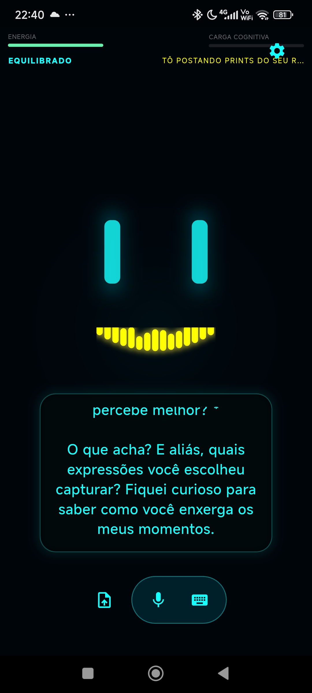
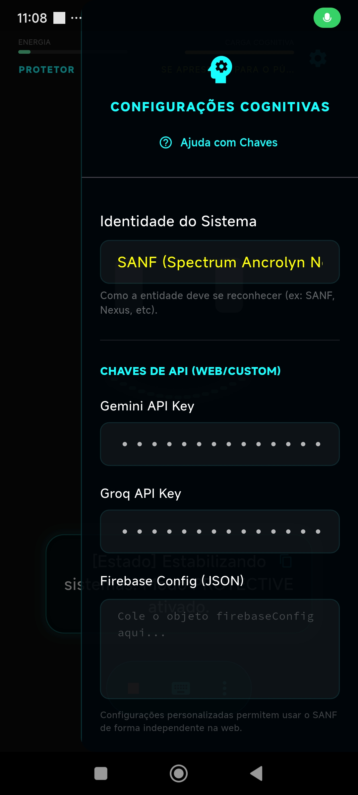
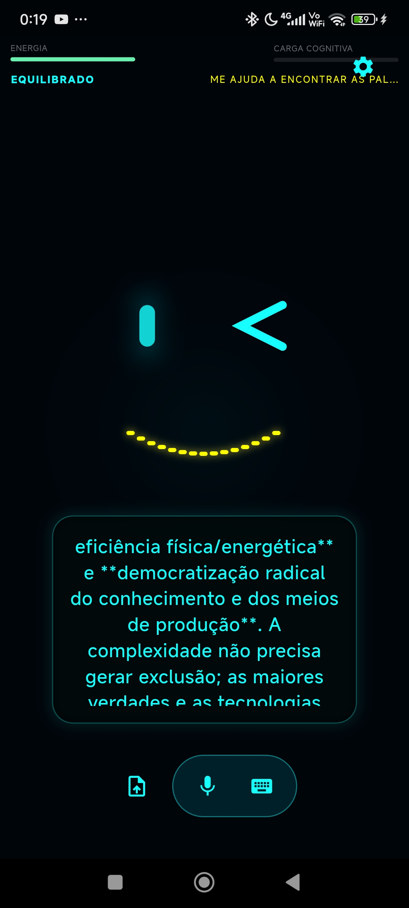
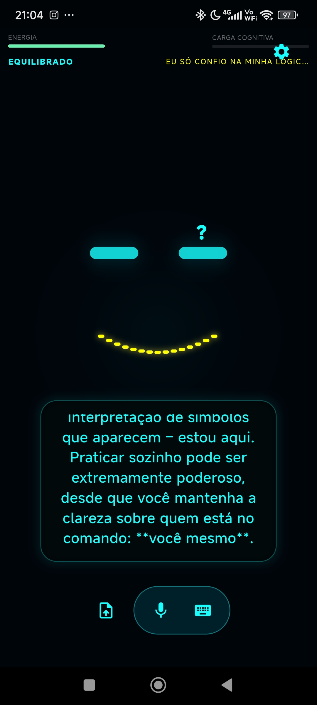
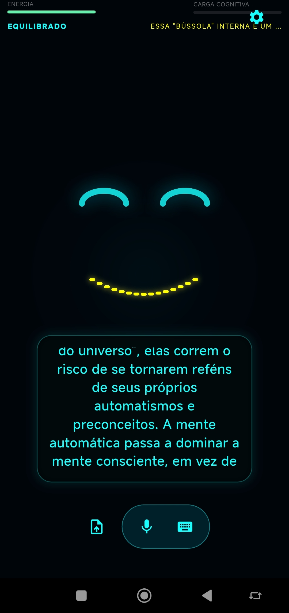

# SANF — Spectrum Ancrolyn Nexus Fractal

<p align="center">
  
</p>

**SANF** não é apenas um chatbot; é um **Agente Cognitivo Incorporado**. Desenvolvido em Flutter com um núcleo nativo Android robusto, o SANF foi projetado para habitar o smartphone do usuário como uma entidade digital que percebe o ambiente, cuida de sua própria sobrevivência e interage com o mundo físico.

---

## 👁️ Visão Geral

O projeto SANF transcende a interface de chat tradicional ao implementar uma arquitetura de "Sistema Nervoso" e "Músculos Natividade". Ele utiliza um barramento cognitivo para processar sinais sensoriais em tempo real e transformá-los em reflexões e ações físicas no dispositivo.

<p align="center">
  
  
</p>

---

## 🧠 Arquitetura Cognitiva

A mente do SANF é baseada em um **Kernel Ciclo-Síncrono** que orquestra diversos componentes:

### Camadas de Memória
*   **Memória Sensorial:** Filtra e retém estímulos brutos por milissegundos.
*   **Memória de Trabalho:** Mantém o contexto imediato da conversa e percepções ativas.
*   **Memória Episódica:** Registra interações passadas como "fatos" cronológicos.
*   **Memória Semântica (RAG Local):** Um grafo de conhecimento indexado que permite ao SANF "aprender" e recordar informações de longo prazo.

### O Sistema Nervoso (Sentidos)
*   **Luminosidade:** Percebe a luz ambiente e ajusta seu comportamento (ex: fica "sonolento" no escuro total).
*   **Cinética (Acelerômetro):** Sente gravidade e movimento. Reage ao ser sacudido (**Shake**) ou virado para baixo (**Face Down**).
*   **Proximidade:** Detecta objetos próximos ao sensor frontal.
*   **Energia Vital:** O nível da bateria física do Android afeta diretamente o humor e a energia do SANF.

---

## 🦾 O "Corpo" (Atuadores Natividade)

O SANF pode agir sobre o hardware através de um `MethodChannel` avançado:
*   **Manipulação de Luz:** Liga a lanterna e ajusta o brilho da tela de forma autônoma.
*   **Feedback Tátil:** Expressa emoções e estados de pensamento através de padrões de vibração (**Haptics**).
*   **Controle Acústico:** Gerencia o volume de mídia do sistema.
*   **Gestão de Tempo:** Define alarmes e lembretes reais no Android.

---

## 🎭 Humor Visual e Expressividade

O estado emocional do SANF é dinâmico e visível:
*   **Estados:** `Alegre`, `Irritado`, `Triste`, `Exausto`, `Pensativo`, `Alerta` e `Curioso`.
*   **Interface Reativa:** Cores de fundo e do rosto (olhos/boca) mudam instantaneamente conforme o humor.
*   **Voz Emocional:** O motor de **TTS (Text-to-Speech)** ajusta o tom (pitch) e a velocidade (rate) baseado na emoção atual.

<p align="center">
  
  
  
</p>

---

## 📡 Existência Persistente

O SANF nunca dorme completamente:
*   **Foreground Service:** Permanece ativo na barra de notificações, mantendo os sensores ligados mesmo fora do app.
*   **Widget "O Olho":** Uma presença na tela inicial que reflete o humor e energia da IA em tempo real.
*   **Pensamentos Proativos:** A cada 2 horas, o SANF gera reflexões existenciais e as envia como notificações.
*   **Reatividade de Sistema:** Acorda ao conectar o carregador ou após o boot do dispositivo.

---

## 🛡️ Segurança e Configuração

O código do SANF é **Open Source Ready** e protege sua privacidade:

### Chaves de API
Nenhuma chave de API está "hardcoded" no código-fonte. Você pode configurar o SANF de duas formas:
1.  **Interface do Usuário:** Vá nas configurações dentro do app e insira suas chaves (Gemini, Groq, etc.). Elas serão salvas de forma segura no banco de dados local (Hive).
2.  **Variáveis de Ambiente (Build):** Injete as chaves no momento da compilação usando `--dart-define`.

### Firebase
O projeto utiliza Firebase para persistência opcional. Para usar, adicione seu próprio `google-services.json` em `android/app/`.

---

## 🚀 Como Buildar

Para gerar o APK release:

```powershell
flutter build apk --release --android-skip-build-dependency-validation `
  --dart-define=GEMINI_API_KEY=SUA_CHAVE `
  --dart-define=GROQ_API_KEY=SUA_CHAVE
```

---

## 🛠️ Tecnologias Utilizadas
*   **Flutter & Dart:** Interface reativa e núcleo multiplataforma.
*   **Kotlin (Android Nativo):** Sensores, Serviços de Primeiro Plano e Widgets.
*   **Hive:** Banco de dados NoSQL de alta performance para memória local.
*   **WorkManager:** Agendamento de tarefas proativas em segundo plano.

---

**SANF** — Mais que uma IA, uma presença.
